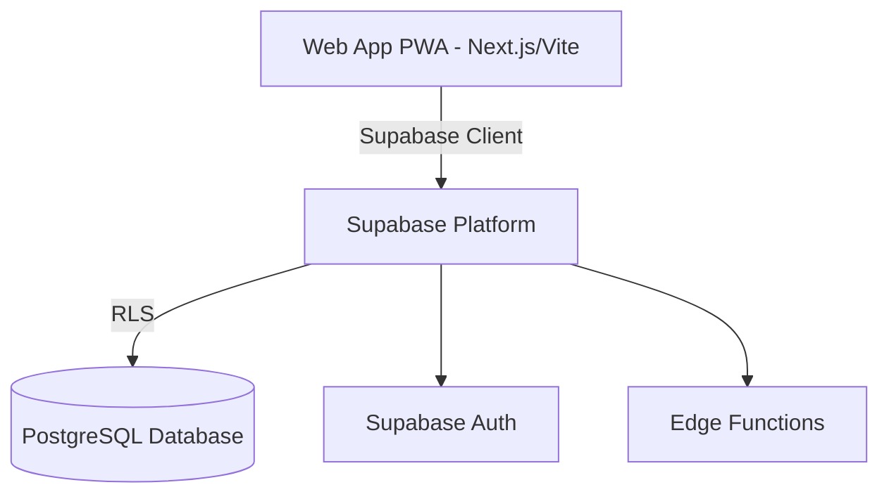
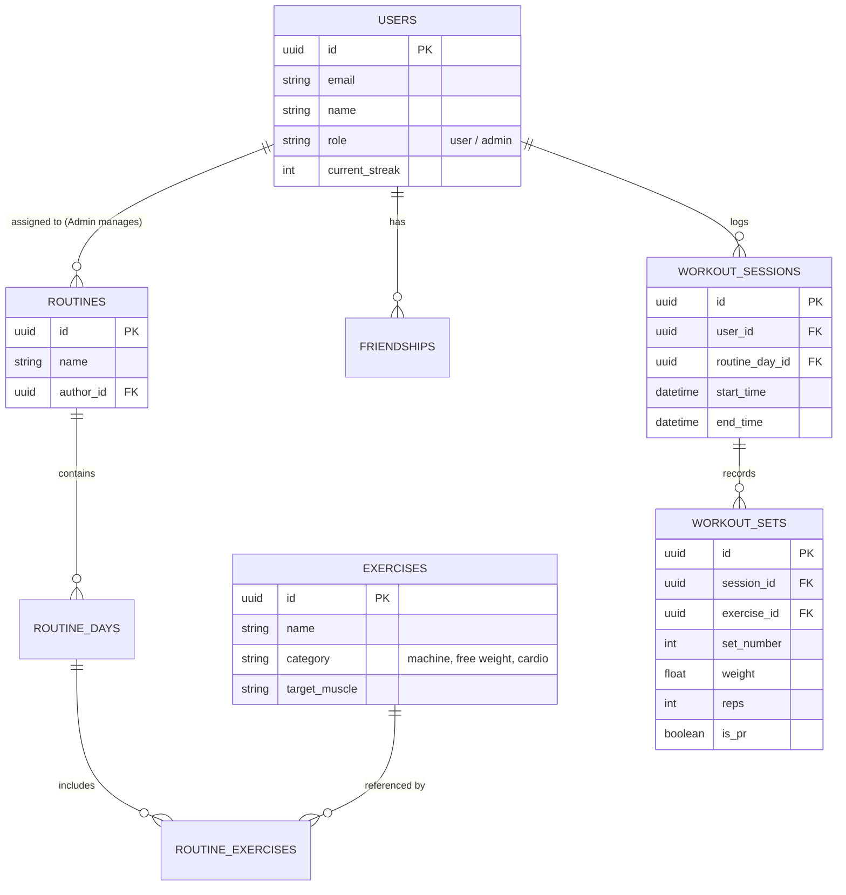

# 2. System Architecture & Design

## 2.1 Technology Stack
- **Frontend / Client**: Next.js (or React/Vite) - Ensures a high-performance, true mobile-first PWA experience with rapid rendering and premium UI animations.
- **Backend / BaaS**: Supabase - Replaces custom Node.js APIs, providing direct database access, authentication, and Edge Functions.
- **Database**: PostgreSQL (managed via Supabase).
- **ORM**: Prisma (or direct Supabase JS Client) - For type-safe database queries.
- **Authentication**: Supabase Auth for out-of-the-box OAuth integrations.
- **Hosting / Infrastructure**: Vercel for web app hosting, GitHub for CI/CD deployments, and Supabase for backend infrastructure.

## 2.2 System Architecture Diagram

## 2.3 Database Schema Design
Below is a visual representation of the proposed relational database schema:

## 2.4 Algorithm Design

### Progressive Overload Algorithm
To ensure users are constantly improving, the system will execute the following logic when an exercise is loaded in an active session:
1. Query the `WORKOUT_SETS` table for the user's most recent session involving this specific `exercise_id`.
2. Compare the previous `weight` and `reps` against the current routine's `target_reps`.
3. **Logic**:
   - If previous `reps` >= `target_reps` across all sets: Prompt the user with a UI badge recommending a weight increase (e.g., "+2.5kg for next set").
   - If previous `reps` < `target_reps`: Prompt the user to maintain the current weight and push for higher reps.

### Leaderboard Ranking (Fitness Score) Algorithm
To calculate the weekly leaderboard, users receive a dynamically calculated "Fitness Score" that balances consistency and performance:
`Score = (Workouts_Completed * 100) + (Total_Volume_Lifted_kg * 0.05) + (Current_Streak * 50) + (PRs_Broken * 200)`
*This ensures that both a high-volume powerlifter and a highly consistent beginner have a fair chance at topping the social leaderboard.*

## 2.5 Data Access & Edge Functions
- **Client DB Queries**: Direct access to `routines`, `workout_sessions`, and `workout_sets` using Supabase JS client with strictly enforced Row Level Security (RLS).
- **Auth**: Supabase Auth standard flows (OAuth).
- **Edge Functions**:
  - `calculate_leaderboard`: Scheduled/triggered function to update weekly Fitness Scores.
  - `assign_routine`: Secure RPC or Edge Function for admins to assign schedules to users.
