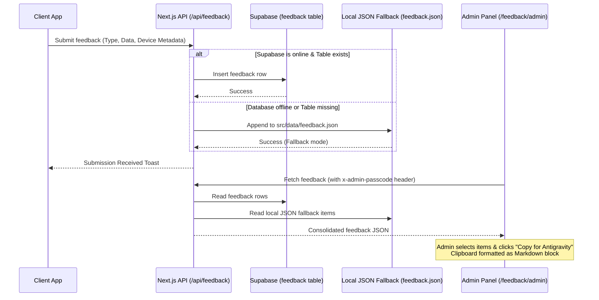

# Implementation Plan - Feedback Hub & Secure Ingestion System

This plan details the implementation of a comprehensive user feedback collection system and a secure admin control panel. It is designed to make it effortless for users to report bugs, request missing exercises, or suggest features, and provides a secure admin tool to generate copy-paste reports for the Antigravity developer agent.

---

## Proposed System Architecture



---

## User Review Required

> [!IMPORTANT]
> - **Dual Storage Strategy (Local JSON + Supabase):** To ensure maximum robustness (such as when testing offline or before database migrations are run), the feedback endpoint writes to a local `src/data/feedback.json` file as a fallback if the Supabase write fails. The Admin panel automatically merges both sources.
> - **Passcode-Gated Access:** The Admin panel is protected by a passcode verified by the API (passcode defined via server environment variable `ADMIN_FEEDBACK_PASSCODE` with local fallback `'vortixia-admin'`). This passcode is cached in the client's `localStorage` to bypass typing it repeatedly.
> - **Metadata Extraction:** Submitting feedback automatically extracts screen size, connection status, browser connection speed, OS, and user agent to help diagnose bugs.

---

## Open Questions

None. The proposed structure completely covers the robust reporting requirement.

---

## Proposed Changes

### Component: Database Migrations

#### [NEW] [feedback_migration.sql](file:///c:/Users/varos/Documents/vortixia-fit/scripts/feedback_migration.sql)
- SQL script to create the `feedback` table, columns, indexes, and Row Level Security (RLS) policies to allow guest submission while reserving read/update access for authenticated admins.

---

### Component: API Routes

#### [NEW] [route.ts](file:///c:/Users/varos/Documents/vortixia-fit/src/app/api/feedback/route.ts)
- Implement `POST`: Extracts user session details (if available), captures the type (`bug`, `suggestion`, `exercise`, `general`), inserts into Supabase `feedback` table, and falls back to local file storage `src/data/feedback.json` if the DB write fails.
- Implement `GET`: Reads from both Supabase and the local JSON file, merges and sorts by date. Gated with a `x-admin-passcode` header check.
- Implement `PATCH`: Allows bulk updating of status (`reviewed` or `archived`) in both Supabase and local JSON. Gated with passcode validation.

---

### Component: Frontend UI

#### [MODIFY] [page.tsx](file:///c:/Users/varos/Documents/vortixia-fit/src/app/profile/feedback/page.tsx)
- Replace the basic exercise request page with a tabbed dashboard:
  - **Bug Tab:** Summarize bug, steps to reproduce, and select severity pills (Low, Medium, High, Critical).
  - **Idea Tab:** Feature title, pain point details, and suggestion descriptions.
  - **Exercise Tab:** Custom name, target muscle, and equipment dropdown.
  - **General Tab:** Open message field.
- Auto-extract client device diagnostics and attach it to requests.
- Prevent iOS Safari zoom by ensuring all input/textarea fields have a font size of `16px` (`text-base`).
- Add a header link to navigate to the Admin panel.

#### [NEW] [page.tsx](file:///c:/Users/varos/Documents/vortixia-fit/src/app/profile/feedback/admin/page.tsx)
- Create a passcode-gated admin viewer:
  - Interactive password screen matching the VortixiaFit dark theme.
  - Analytics badges displaying counts of pending bugs, ideas, exercises, and general messages.
  - Interactive filters by type and status (`pending`, `reviewed`, `archived`).
  - Table selection checkboxes.
  - **Antigravity Copier Button:** Combines selected feedback rows and formats them into a clean Markdown block (including user-agent and OS diagnostics) and copies it to the clipboard, ready to be pasted directly into this conversation transcript.
  - Bulk actions to mark items reviewed or archived.

---

## Verification Plan

### Automated Verification
- Compile code to verify zero TypeScript errors:
  ```powershell
  npm run build
  ```

### Manual Verification
1. **Submit Feedback:** Go to `/profile/feedback`, submit a Bug Report and a Missing Exercise request, check console logs, and verify a success toast displays.
2. **Local Fallback:** Verify that the submissions are recorded inside the new file `src/data/feedback.json` if Supabase migrations aren't executed yet.
3. **Database Sync:** Run the SQL script in Supabase, submit feedback, and verify it inserts a row in the `feedback` table.
4. **Admin Access:** Go to `/profile/feedback/admin`, type the passcode `vortixia-admin`, and verify you gain access and the local storage cache is set.
5. **Report Copier:** Select two feedback items, click "Copy for Antigravity", paste into a text editor, and verify the output is cleanly formatted markdown with device metadata.
