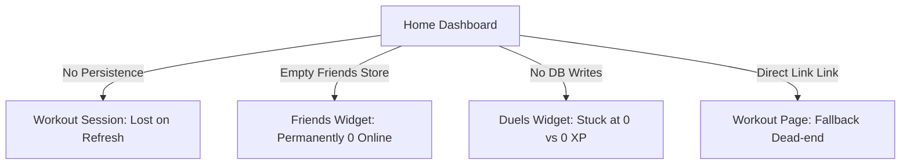

# VortixiaFit — Dashboard & Feature Integration Audit Report

> **Date:** June 25, 2026  
> **Prepared by:** Antigravity (Lead Manager Agent)  
> **Scope:** Audit of the Home Dashboard (`src/app/page.tsx`) against all active feature modules (Workouts, Routines, Recovery, Social, Duels, Notifications)  
> **Status:** Swarm subagents completed deeper detections. Consolidated findings below.

---

## Executive Summary

The Home Dashboard is the visual center of VortixiaFit. However, an in-depth audit reveals major **integration friction and silent state desynchronizations** between the dashboard widgets and the underlying feature pages:



| Feature / Widget | Integration Status | Core Issues | Severity |
| :--- | :--- | :--- | :--- |
| **Start Workout Card** | ⚠️ Weak / Dead-end UX | Redirects to `/workout` even if no session is active, hitting a "No Active Workout" page. | 🔴 High |
| **Active Workout Sync** | ❌ Broken Sync & State | Network drops mid-sync cause duplicate logs & XP wagers; active workout is wiped on reload. | 🔴 High |
| **Routines / Editor** | ❌ Local Only / Overwritten | Guest edits are wiped; logged-in edits are overwritten on reload because there's no write sync to database. | 🔴 High |
| **CNS Readiness** | ⚠️ SSR Hydration Warns | Persisted values mismatch SSR initial state; recommendation logic is flawed when CNS fatigue is general. | 🟡 Medium |
| **Social / Duels** | ❌ Score Desync | Duel score progress is only updated in local storage, never written to the Supabase database. | 🔴 High |
| **Friends Widget** | ❌ Empty Friends Store | Dashboard reads from disconnected `useFriendsStore`, resulting in permanently `0 Online`. | 🔴 High |
| **Rest Timer** | 🟡 Duplicated & Fragile | Duplicate ticking timers in store vs component; navigating away from active workout kills timer UI. | 🟡 Medium |

---

## 1. Active Workout & Sync Architecture

### 🔴 Critical Sync Loop Bug (Duplicate Workouts)
* **File:** [GlobalListeners.tsx](file:///c:/Users/varos/Documents/vortixia-fit/src/components/GlobalListeners.tsx#L67-L115)
* **Issue:** When syncingcached offline workouts (`unsynced_workouts`), if any network request or RPC call fails mid-loop, the function throws. The `try/catch` block logs the error, but the final `localStorage.removeItem('unsynced_workouts')` is bypassed completely. On next load or reconnection, the entire queue is re-run, causing duplicate workout sessions, duplicate sets, and infinite duplicate XP rewards in the DB.
* **Solution:** Refactor the loop to remove workouts individually as they sync successfully, or update the array in `localStorage` iteratively inside the loop:
  ```typescript
  const workouts = JSON.parse(unsynced);
  const remainingWorkouts = [...workouts];
  for (const workout of workouts) {
    try {
      // 1. Insert session & sets, increment XP via RPC
      ...
      // 2. Shift processed workout and update cache
      remainingWorkouts.shift();
      localStorage.setItem('unsynced_workouts', JSON.stringify(remainingWorkouts));
    } catch (e) {
      console.error('Failed to sync workout, pausing queue:', e);
      break;
    }
  }
  if (remainingWorkouts.length === 0) {
    localStorage.removeItem('unsynced_workouts');
  }
  ```

### 🔴 State Loss on Page Reload
* **File:** [useWorkoutStore.ts](file:///c:/Users/varos/Documents/vortixia-fit/src/store/useWorkoutStore.ts#L45-L53)
* **Issue:** Unlike the routines store, `useWorkoutStore` is not persisted. A page refresh or a PWA process termination (frequent on iOS Safari) wipes the active session state, elapsed time, and completed sets.
* **Solution:** Add Zustand `persist` middleware to `useWorkoutStore`.

### 🟡 Rest Timer Disconnection & Discrepancies
* **Files:** [RestTimer.tsx](file:///c:/Users/varos/Documents/vortixia-fit/src/components/RestTimer.tsx#L13-L43) and [workout/page.tsx](file:///c:/Users/varos/Documents/vortixia-fit/src/app/workout/page.tsx#L37-L53)
* **Issue:** The rest timer runs two concurrent, independent tick loops: a store-level `tickRest()` and a component-level `setInterval`. Adjusting rest time in the UI (`+`/`-` buttons) only updates the component state, creating a desync. If a user navigates away from the workout page, the component is unmounted and they lose all rest tracking visuals.
* **Solution:**
  1. Bind the `RestTimer` component directly to Zustand's global `restTimeRemaining`, `isResting`, `stopRest`, and `addRestTime`.
  2. Relocate the `RestTimer` overlay to `src/app/layout.tsx` so it floats globally over the bottom navigation, allowing users to browse their profile/social arena during rest periods.

---

## 2. Routines & Templates Integration

### 🔴 Home Dashboard "Start Workout" Dead-End
* **File:** [page.tsx](file:///c:/Users/varos/Documents/vortixia-fit/src/app/page.tsx#L430-L457)
* **Issue:** The dashboard's primary CTA card is wrapped in a static `<Link href="/workout">`. If no workout is active, this takes the user to `/workout`, which renders a fallback screen: *"No Active Workout. Go to Routines."* This creates a tedious user flow.
* **Solution:** Replace the static link with a dynamic click handler:
  - If a workout is active, route to `/workout`.
  - If no workout is active, check if today is a training day in `weeklyPlan`. If so, programmatically initialize `startWorkout(todayPlan.title, todayPlan.mainLifts)` and route to `/workout`.
  - If it is a rest day, route to `/routines` and toast: *"Today is a Rest Day! Let's choose another workout or template."*

### 🔴 Overwritten Custom / Offline Routines
* **File:** [useRoutineStore.ts](file:///c:/Users/varos/Documents/vortixia-fit/src/store/useRoutineStore.ts#L297-L301)
* **Issue:** The routine store's `partialize` configuration only saves the `customTemplates` array. The active `weeklyPlan` split is not cached. On page refresh, `weeklyPlan` is reset to `[]`, which triggers `fetchRoutine()`. For offline or guest users, this defaults back to the hardcoded Push/Pull/Legs split, completely erasing their customized split.
* **Solution:** Save `weeklyPlan` inside the partialize config and update `fetchRoutine` to preserve local changes if no session is active.

### 🔴 Read-Only Routine Edits for Logged-In Users
* **Files:** [useRoutineStore.ts](file:///c:/Users/varos/Documents/vortixia-fit/src/store/useRoutineStore.ts#L111) & [routines/edit/page.tsx](file:///c:/Users/varos/Documents/vortixia-fit/src/app/routines/edit/page.tsx#L40-L45)
* **Issue:** When a logged-in user saves edits in the Routine Editor, it updates the local Zustand `weeklyPlan`. However, there is no database write sync implemented for routines. On reload, `fetchRoutine` pulls the old unmodified routine from Supabase, overwriting all local changes.
* **Solution:** Implement a `saveRoutineToDb` sync action in `useRoutineStore.ts` that performs an upsert of the routine, days, and planned exercises structure, and call it when saving edits.

### 🔴 Guest Lockout from Local AI Routine Generator
* **Files:** [routines/templates/page.tsx](file:///c:/Users/varos/Documents/vortixia-fit/src/app/routines/templates/page.tsx#L59-L88) & [api/ai/generate/route.ts](file:///c:/Users/varos/Documents/vortixia-fit/src/app/api/ai/generate/route.ts#L10-L12)
* **Issue:** The AI routine generator (`generateRoutine` from `@/lib/ixia-ai`) is a local, deterministic generator. However, the templates page calls it through the API `/api/ai/generate`, which enforces strict Supabase authentication. This locks out offline and guest users from using the generator.
* **Solution:** Remove the strict `401 Unauthorized` check from the API route (since it is a local data selector and does not touch user data), or run the generator client-side when no session is present.

---

## 3. Recovery & Muscle Map Systems

### 🟡 Hydration Mismatch Risk
* **Files:** [page.tsx](file:///c:/Users/varos/Documents/vortixia-fit/src/app/page.tsx#L460-L478) & [recovery/page.tsx](file:///c:/Users/varos/Documents/vortixia-fit/src/app/recovery/page.tsx#L45-L56)
* **Issue:** Both pages directly read `readinessScore` and `cnsStatus` from the persisted Zustand store. Since SSR renders the initial state (100% / Fresh CNS) but the client hydrates with the local storage state, this causes text content mismatch warnings.
* **Solution:** Wrap these displays inside a `mounted` check or read them only inside `useEffect` / client-only components.

### 🟡 Flawed Dashboard Recovery Recommendation Logic
* **File:** [page.tsx](file:///c:/Users/varos/Documents/vortixia-fit/src/app/page.tsx#L159-L170)
* **Issue:** If all muscles are at `55%`, the overall CNS readiness is `55%` (Recovering CNS), yet the advice displays: *"All muscles recovered. Ready to crush your targets!"*. This contradicts the score's state.
* **Solution:** Fallback to checks on the overall `readinessScore` if no individual muscles are heavily fatigued:
  ```typescript
  if (tiredMuscles.length > 0) {
    setFatiguedMuscleRecommendation(`${tiredMuscles[0].name} is fatigued (${Math.round(tiredMuscles[0].recoveryPercentage)}%). Avoid training it today.`);
  } else if (readinessScore < 80) {
    setFatiguedMuscleRecommendation(`CNS is recovering (${readinessScore}%). Focus on light active recovery or rest.`);
  } else {
    setFatiguedMuscleRecommendation("All muscles recovered. Ready to crush your targets!");
  }
  ```

### 🟡 MuscleMapCanvas Discrepancies
* **Files:** [MuscleMapCanvas.tsx](file:///c:/Users/varos/Documents/vortixia-fit/src/components/MuscleMapCanvas.tsx#L16-L42)
* **Issues:**
  1. Gender settings are ignored: `MuscleMapCanvas` initializes `MuscleMapWidget` with a hardcoded `gender: 'male'`, ignoring the user's `heroGender` configuration.
  2. Gluteal muscle missing: The `legs` recovery group maps to quadriceps/calves/hamstring, but completely omits `gluteal`. The glutes remain uncolored (black) on the back view of the heatmap even if legs are severely fatigued.
  3. Interactive Tooltips: The component calls `widgetRef.current.enableTooltip()`, but the widget is initialized with `interactive: false` and the container has `pointer-events-none`. Pointer events never reach the canvas, making the tooltip initialization dead code.
* **Solutions:**
  1. Fetch `heroGender` from `useSettingsStore` and bind it to the widget.
  2. Map `legs` recovery to the `gluteal` muscle.
  3. Remove the dead tooltip code or enable pointer events and set `interactive: true`.

---

## 4. Social Arena, Duels & Community

### 🔴 Duel Score Tracking Desync
* **Files:** [ChallengeFriendModal.tsx](file:///c:/Users/varos/Documents/vortixia-fit/src/components/ChallengeFriendModal.tsx), [social/page.tsx](file:///c:/Users/varos/Documents/vortixia-fit/src/app/social/page.tsx), [workout/page.tsx](file:///c:/Users/varos/Documents/vortixia-fit/src/app/workout/page.tsx)
* **Issue:** When a workout is completed, progress is only pushed locally via `updateDuelProgress(totalVolume, earnedXP)` updating the local storage array `activeDuels`. There is no write logic to update the `user_1_score` or `user_2_score` columns in the database `duels` table. Consequently, all active duels in the UI remain stuck at `0 vs 0 XP`.
* **Solution:** In `saveWorkoutToDb` inside `useWorkoutStore.ts`, retrieve active duels for the user from Supabase and increment their score column directly in the database.

### 🔴 Disconnected Friends Store (Permanently 0 Online Friends)
* **Files:** [useFriendsStore.ts](file:///c:/Users/varos/Documents/vortixia-fit/src/store/useFriendsStore.ts) & [page.tsx](file:///c:/Users/varos/Documents/vortixia-fit/src/app/page.tsx#L232)
* **Issue:** `useFriendsStore.ts` starts with an empty `friends: []` array and has no fetching methods. The dashboard counts online friends from this store, resulting in a permanent `0 Online` status.
* **Solution:** Implement a `fetchFriends` action in `useFriendsStore.ts` that retrieves accepted friends and status, and reuse this in the dashboard and the social page.

### 🟡 Visual Duel Progress Bar and Friend Completions
* **Files:** [social/page.tsx](file:///c:/Users/varos/Documents/vortixia-fit/src/app/social/page.tsx#L344) & [page.tsx](file:///c:/Users/varos/Documents/vortixia-fit/src/app/page.tsx#L222)
* **Issues:**
  1. The progress bar in the duel list card has a hardcoded `style={{ width: '50%' }}` width, preventing real visual progression.
  2. The friend completion count on the dashboard does not filter unique friends, showing inflated counts if one friend completes multiple workouts.
* **Solutions:**
  1. Calculate progress: `style={{ width: `${myScore + oppScore > 0 ? (myScore / (myScore + oppScore)) * 100 : 50}%` }}`.
  2. Count unique user IDs: `new Set(sessions.map(s => s.user_id)).size`.

### 🟡 recommendedAthletes Query Inefficiency
* **File:** [page.tsx](file:///c:/Users/varos/Documents/vortixia-fit/src/app/page.tsx#L50)
* **Issue:** The dashboard calls `/api/search?q=` which loads up to 50 users and returns their full profile data, only to slice it to 5.
* **Solution:** Pass a limit parameter: `/api/search?q=&limit=5` and handle it in `/api/search/route.ts`.

---

## Action Plan: Priority Fixes

1. **Active Workout State Persistence:** Add Zustand persist to `useWorkoutStore`.
2. **Robust Offline Queue Sync:** Fix the try-catch loop block in `GlobalListeners.tsx` so failure doesn't bypass queue updates.
3. **Database Sync for Duel Scores:** Add Supabase score increment logic inside `saveWorkoutToDb`.
4. **Dynamic CTA Navigation:** Make the dashboard "Start Workout" tile launch the correct workout plan for today.
5. **Routine DB writes:** Wire up database syncing in the routine store so modifications are persisted in Supabase for authenticated users.
6. **Fetch friends in useFriendsStore:** Wire up friends syncing to fix the dashboard's "Online Friends" display.
7. **Muscle Map fixes:** Apply gender bindings and map gluteal colors.
