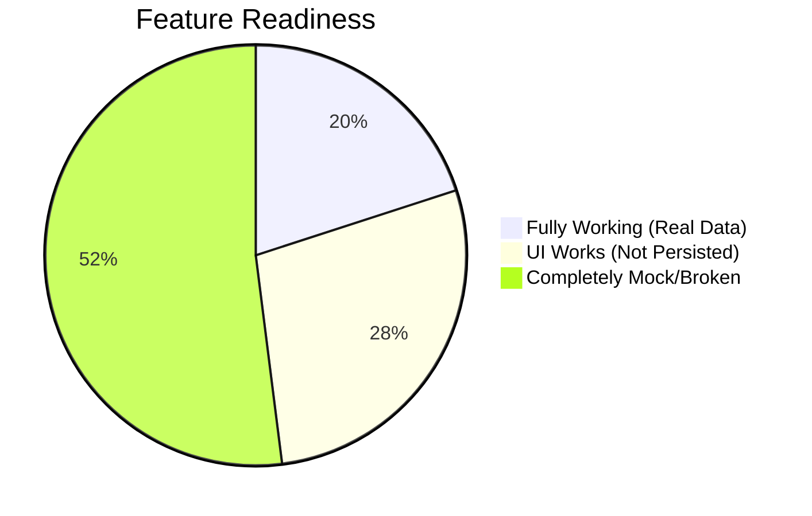
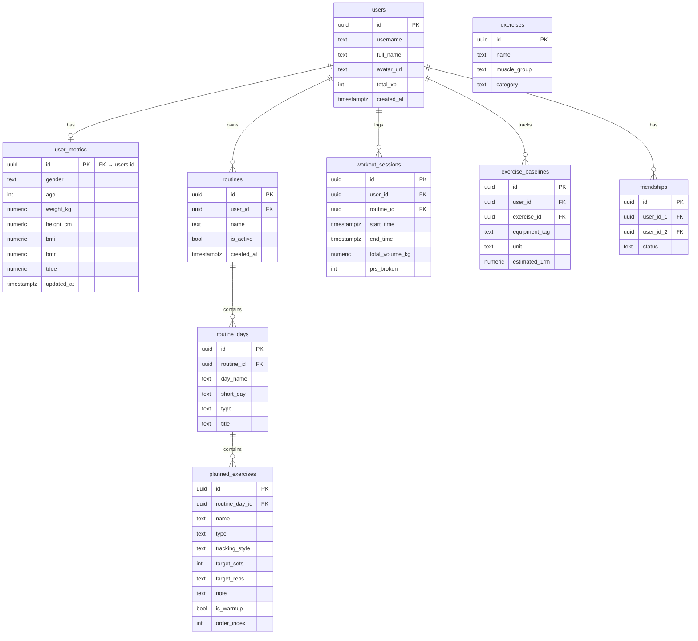

# VortixiaFit — Comprehensive Project Audit

> **Date:** June 23, 2026
> **Scope:** Full-stack audit — Auth, Database, State Management, UI/UX, PWA, Accessibility
> **Verdict:** The app is a **visually stunning shell** with a solid foundation, but the majority of features are **non-functional or use mock data.** Only ~20% of features work end-to-end with real data.

---

## Executive Summary



| Layer | Status |
|-------|--------|
| **Authentication** | ✅ Working (Google OAuth, Magic Link) — but has security bugs |
| **Database Schema** | ⚠️ Partial — 9 tables exist, but 5+ features have no backing tables |
| **State Management** | ❌ 6 of 8 Zustand stores are local-only — data lost on refresh |
| **Core Workout Engine** | ❌ **Critical** — workouts are never saved to database |
| **Social Features** | ❌ 100% mock data, no database tables |
| **Recovery System** | ⚠️ UI works, nothing persists |
| **Analytics** | ❌ All charts show hardcoded fake data |
| **AI Assistant (Ixia)** | ❌ API key inaccessible client-side; "AI" is a random algorithm |
| **Settings** | ❌ No persistence, buttons non-functional |
| **PWA** | ⚠️ Basic service worker, no offline workout support |

---

## Table of Contents

1. [Critical Bugs & Security Issues](#1-critical-bugs--security-issues)
2. [Authentication & Middleware](#2-authentication--middleware)
3. [Database Schema Gaps](#3-database-schema-gaps)
4. [State Management (Zustand Stores)](#4-state-management-zustand-stores)
5. [Page-by-Page Audit](#5-page-by-page-audit)
6. [Component Audit](#6-component-audit)
7. [UI/UX Issues](#7-uiux-issues)
8. [Dead Code & Cleanup](#8-dead-code--cleanup)
9. [Accessibility Issues](#9-accessibility-issues)
10. [Feature Readiness Matrix](#10-feature-readiness-matrix)
11. [Suggested Approach & Prioritized Roadmap](#11-suggested-approach--prioritized-roadmap)

---

## 1. Critical Bugs & Security Issues

> [!CAUTION]
> These issues should be fixed **immediately** — they pose security risks or break core functionality.

### 🔴 Open Redirect Vulnerability
- **File:** [route.ts](file:///c:/Users/varos/Documents/vortixia-fit/src/app/auth/callback/route.ts) (Line 9)
- **Issue:** The `next` query parameter is used directly in redirect URLs without validation. An attacker can craft a URL like `/auth/callback?code=xxx&next=//evil.com` to redirect authenticated users to a malicious site.
- **Fix:** Validate that `next` starts with `/` and doesn't contain `//` or protocol schemes.

### 🔴 Session Cookie Loss on Redirect
- **File:** [middleware.ts](file:///c:/Users/varos/Documents/vortixia-fit/src/middleware.ts) (Lines 42, 49)
- **Issue:** When redirecting unauthenticated users, a fresh `NextResponse.redirect()` is returned instead of the `supabaseResponse` that may contain refreshed session cookies. This can cause **session refresh loops** where a nearly-expired token never gets renewed.
- **Fix:** Copy cookies from `supabaseResponse` onto the redirect response before returning it.

### 🔴 Dev Buttons Exposed to Users
- **File:** [social/page.tsx](file:///c:/Users/varos/Documents/vortixia-fit/src/app/social/page.tsx) (Lines 132–138) — "Simulate Opponent" dev button visible to all users
- **File:** [recovery/page.tsx](file:///c:/Users/varos/Documents/vortixia-fit/src/app/recovery/page.tsx) (Lines 86–90) — "+12h (Dev)" fast-forward button visible to all users
- **Fix:** Remove or gate behind `process.env.NODE_ENV === 'development'`.

### 🔴 Operator Precedence Bug
- **File:** [workout/page.tsx](file:///c:/Users/varos/Documents/vortixia-fit/src/app/workout/page.tsx) (Line 85)
- **Issue:** `name.includes('press') && name.includes('overhead') || name.includes('raise')` — `&&` binds tighter than `||`, so ANY exercise with "raise" matches "shoulders" regardless.
- **Fix:** Add parentheses: `(name.includes('press') && name.includes('overhead')) || name.includes('raise')`

### 🔴 Dynamic Tailwind Class (Won't Work)
- **File:** [page.tsx](file:///c:/Users/varos/Documents/vortixia-fit/src/app/page.tsx) (Line 234)
- **Issue:** `z-[${4-i}]` uses string interpolation for Tailwind class — Tailwind JIT requires **static** class strings. This z-index is silently ignored.
- **Fix:** Use a lookup array: `const zIndex = ['z-[4]', 'z-[3]', 'z-[2]', 'z-[1]']`

### 🔴 XP Desync — Two Separate Sources
- **Files:** [useTrophyStore.ts](file:///c:/Users/varos/Documents/vortixia-fit/src/store/useTrophyStore.ts) (totalXP in localStorage) vs [useProfileStore.ts](file:///c:/Users/varos/Documents/vortixia-fit/src/store/useProfileStore.ts) (`total_xp` from Supabase)
- **Issue:** Two completely separate XP values that are never synchronized. The trophy store tracks XP locally, while the profile store reads from the database.
- **Fix:** Single source of truth — use Supabase `users.total_xp` and remove the local XP tracker.

---

## 2. Authentication & Middleware

### What Works ✅
- Google OAuth login via Supabase Auth
- Apple OAuth button (configured)
- Magic Link (email OTP) login
- Auth callback with session exchange
- User profile auto-creation on first login
- Middleware redirects unauthenticated users to `/login`
- Middleware redirects authenticated users away from `/login`
- Logout functionality

### What's Broken/Missing ❌

| Issue | File | Severity |
|-------|------|----------|
| **"Continue as Guest" / Guest mode doesn't work** — middleware blocks all unauthenticated routes | Login page | 🔴 High |
| **"Sign Up" link is a dead `<span>`** — no onClick or href | [login/page.tsx](file:///c:/Users/varos/Documents/vortixia-fit/src/app/login/page.tsx) L130 | 🔴 High |
| **`user_metrics` row never created on signup** — new users see empty/zero metrics | [callback/route.ts](file:///c:/Users/varos/Documents/vortixia-fit/src/app/auth/callback/route.ts) | 🔴 High |
| **No username uniqueness check** — duplicate names from Google | [callback/route.ts](file:///c:/Users/varos/Documents/vortixia-fit/src/app/auth/callback/route.ts) L38 | 🟡 Medium |
| **OAuth error not shown on login page** — `?error=OAuth_failed` param is never read | [login/page.tsx](file:///c:/Users/varos/Documents/vortixia-fit/src/app/login/page.tsx) | 🟡 Medium |
| **`alert()` for magic link success** — should be a toast | [login/page.tsx](file:///c:/Users/varos/Documents/vortixia-fit/src/app/login/page.tsx) L44 | 🟡 Medium |
| **No `onAuthStateChange` listener** — no multi-tab session sync, no token expiry handling | Layout level | 🟡 Medium |
| **No server-side Supabase client utility** — duplicated boilerplate in middleware + callback | [supabase.ts](file:///c:/Users/varos/Documents/vortixia-fit/src/lib/supabase.ts) | 🟡 Medium |
| **Uses `getSession()` instead of `getUser()`** — stores use JWT from local storage without server validation | [useProfileStore.ts](file:///c:/Users/varos/Documents/vortixia-fit/src/store/useProfileStore.ts), [useSocialStore.ts](file:///c:/Users/varos/Documents/vortixia-fit/src/store/useSocialStore.ts) | 🟡 Medium |
| **BottomNav renders on login page** — should be hidden for unauthenticated routes | [layout.tsx](file:///c:/Users/varos/Documents/vortixia-fit/src/app/layout.tsx) L60 | 🟡 Medium |
| **Login input font-size 15px** — must be ≥16px to prevent iOS Safari auto-zoom | [login/page.tsx](file:///c:/Users/varos/Documents/vortixia-fit/src/app/login/page.tsx) L115 | 🟢 Low |
| **No post-login redirect to intended page** — always goes to `/` | [callback/route.ts](file:///c:/Users/varos/Documents/vortixia-fit/src/app/auth/callback/route.ts) | 🟢 Low |

### Suggested Approach

1. **Fix security bugs first** (open redirect, cookie loss)
2. Create `lib/supabase-server.ts` for server-side client
3. Add `onAuthStateChange` listener in layout
4. Create `user_metrics` row in auth callback
5. Use `(auth)` and `(app)` route groups to separate authenticated vs public layouts
6. Remove or implement guest mode

---

## 3. Database Schema Gaps

### Current Supabase Schema (9 tables)



### Missing Tables

> [!IMPORTANT]
> These tables are needed to support features that currently have no database backing.

| Missing Table | Needed For | Suggested Columns |
|---------------|-----------|-------------------|
| **`workout_sets`** | Logging individual sets during workouts | `id`, `session_id`, `exercise_name`, `set_number`, `weight`, `reps`, `duration_sec`, `is_pr`, `is_warmup`, `created_at` |
| **`user_trophies`** | Persisting unlocked achievements | `id`, `user_id`, `trophy_id`, `unlocked_at` |
| **`recovery_logs`** | Daily recovery tracking | `id`, `user_id`, `date`, `sleep_hours`, `sleep_quality`, `mood`, `hydration`, `soreness_data` (jsonb), `recovery_score`, `created_at` |
| **`social_posts`** | Social feed | `id`, `user_id`, `content`, `image_url`, `workout_session_id`, `created_at` |
| **`post_likes`** | Post likes | `id`, `post_id`, `user_id`, `created_at` |
| **`post_comments`** | Post comments | `id`, `post_id`, `user_id`, `content`, `created_at` |
| **`challenges`** | Friend challenges/duels | `id`, `challenger_id`, `challenged_id`, `type`, `status`, `start_date`, `end_date`, `challenger_score`, `challenged_score` |
| **`feedback`** | User feedback | `id`, `user_id`, `category`, `message`, `rating`, `created_at` |
| **`user_settings`** | Settings persistence | `id` (FK users), `weight_unit`, `height_unit`, `time_format`, `theme`, `notification_prefs` (jsonb) |

### Existing Table Issues

| Table | Issue |
|-------|-------|
| `users` | Contains 4 hardcoded mock users (`00000000-...` UUIDs) alongside 3 real OAuth users |
| `exercises` | **0 rows** — never seeded. The app uses `exerciseLibrary.json` instead |
| `workout_sessions` | **0 rows** — schema exists but the app never writes to it |
| `exercise_baselines` | **0 rows** — never populated |
| `friendships` | Has 3 rows but the `useFriendsStore` doesn't query it — uses hardcoded mock friends instead |
| No triggers | No auto-profile creation on signup (handled manually in callback, but fragile) |
| No stored procedures | No server-side business logic (leaderboard calculation, XP awarding, etc.) |
| No migrations tracked | Schema changes aren't versioned |

### RLS Policies — Current State

All tables have RLS enabled with appropriate policies. The policies look correct:
- Users can view any profile (for social features) but only edit their own
- Routine/exercise access is scoped to the owning user
- Friendships accessible to both parties
- Exercise library is readable by anyone

> [!TIP]
> The RLS policies are well-designed. When adding new tables, follow the same pattern.

---

## 4. State Management (Zustand Stores)

### Store Sync Status

| Store | Supabase Read | Supabase Write | localStorage | Mock Data | Critical Issues |
|-------|:---:|:---:|:---:|:---:|---|
| [useProfileStore](file:///c:/Users/varos/Documents/vortixia-fit/src/store/useProfileStore.ts) | ✅ | ⚠️ Insert only | ❌ | ❌ | No `updateProfile()` or `updateMetrics()` method |
| [useRoutineStore](file:///c:/Users/varos/Documents/vortixia-fit/src/store/useRoutineStore.ts) | ❌ | ❌ | ❌ | ✅ | Imports Supabase but **never uses it** — loads hardcoded templates |
| [useWorkoutStore](file:///c:/Users/varos/Documents/vortixia-fit/src/store/useWorkoutStore.ts) | ❌ | ❌ | ❌ | ✅ | **Core feature broken** — workouts lost on finish |
| [useSocialStore](file:///c:/Users/varos/Documents/vortixia-fit/src/store/useSocialStore.ts) | ✅ Leaderboard | ❌ | ✅ Duels | ⚠️ | Leaderboard reads from Supabase; duels are local only with simulated opponent |
| [useFriendsStore](file:///c:/Users/varos/Documents/vortixia-fit/src/store/useFriendsStore.ts) | ❌ | ❌ | ❌ | ✅ | 5 completely fake friends, despite `friendships` table existing |
| [useRecoveryStore](file:///c:/Users/varos/Documents/vortixia-fit/src/store/useRecoveryStore.ts) | ❌ | ❌ | ✅ | ✅ | Muscle recovery via time-decay only, no DB |
| [useTrophyStore](file:///c:/Users/varos/Documents/vortixia-fit/src/store/useTrophyStore.ts) | ❌ | ❌ | ✅ | ✅ | Local XP separate from Supabase XP; unreachable trophy (`t_lvl_10`) |
| [useSettingsStore](file:///c:/Users/varos/Documents/vortixia-fit/src/store/useSettingsStore.ts) | ❌ | ❌ | ❌ | ✅ | Only `heroGender` toggle, resets on refresh |

### Key Store Issues

1. **`useRoutineStore` — Supabase imported but never called** (Line 2: `import { supabase }` — dead import). The `fetchRoutine()` function has a comment: _"For prototyping we load the default template instead of DB"_ and loads from `PREDEFINED_TEMPLATES[0]`.

2. **`useWorkoutStore` — Previous performance is randomly generated** (Line 57: `previousWeight: 135 + Math.floor(Math.random() * 4) * 10`). Comment says "Mock previous performance."

3. **`useFriendsStore` — Completely separate from `useSocialStore`** — Friends store has fake data while Social store actually queries Supabase `friendships` table for the leaderboard. These two stores are disconnected.

4. **`useSocialStore` — Friendships query is unidirectional** (Line 55: only queries `user_id_1 = userId`). Won't find friendships where the current user is `user_id_2`.

5. **`useTrophyStore` — Unreachable trophy** — `t_lvl_10` is defined in `trophies.json` but `checkAchievements()` never evaluates its unlock condition.

6. **`useProfileStore` — `window.location.href` in logout** — Hard-navigates instead of using Next.js router, causing full page reload.

### Suggested Approach

The stores need a fundamental restructuring:

1. **Phase 1:** Connect `useRoutineStore` to Supabase (it's the closest to ready)
2. **Phase 2:** Build `useWorkoutStore` persistence (most critical feature gap)
3. **Phase 3:** Merge `useFriendsStore` into `useSocialStore` and connect to Supabase
4. **Phase 4:** Add persistence for Recovery, Trophies, Settings

All stores should follow this pattern:
```typescript
// Pattern for Supabase-connected stores
const useExampleStore = create<State>((set, get) => ({
  data: null,
  isLoading: false,
  error: null,

  fetch: async () => {
    set({ isLoading: true, error: null })
    try {
      const { data, error } = await supabase.from('table').select('*')
      if (error) throw error
      set({ data, isLoading: false })
    } catch (err) {
      set({ error: err.message, isLoading: false })
    }
  },
  // ... mutations follow same pattern
}))
```

---

## 5. Page-by-Page Audit

### Home Page — [page.tsx](file:///c:/Users/varos/Documents/vortixia-fit/src/app/page.tsx) (`/`)

| Element | Source | Status |
|---------|--------|--------|
| Greeting + user name | Profile store → Supabase | ✅ Real |
| Weather widget | Open-Meteo API | ✅ Real |
| Weekly streak (M-S dots) | Hardcoded array (L32-40) | ❌ Mock |
| "Today's Plan" card | Hardcoded "Leg Day Crusher" (L141) | ❌ Mock — should read routine store |
| Readiness/Recovery score | Fallback to `54` (L159), always "Fatigued" (L160) | ❌ Mock |
| Calories card | Hardcoded "1.7k", 60% ring | ❌ Mock ("Coming Soon") |
| Sleep score card | Hardcoded "89%", fixed percentages | ❌ Mock ("Coming Soon") |
| Active Duel card | Hardcoded "1st", "+2,150 XP" | ❌ Mock |
| Trophy card | Hardcoded "35 days in a row" | ❌ Mock |
| "+500 XP" tasks card | No click handler | ❌ Non-functional |

---

### Workout Page — [workout/page.tsx](file:///c:/Users/varos/Documents/vortixia-fit/src/app/workout/page.tsx) (`/workout`)

| Action/Element | Status | Issue |
|---------------|--------|-------|
| Exercise list from routine | ✅ Works | Reads from routine store |
| Set completion (weight/reps) | ⚠️ UI works | Data is local only, not persisted |
| Rest timer | ✅ Works | Local countdown, no sound/vibration |
| Plate calculator | ✅ Works | Only supports lbs, not kg |
| "Finish Workout" | ❌ **Critical** | Doesn't save anything — all data lost |
| Success carousel/summary | ⚠️ Shows | All stats are hardcoded/mock |
| `isFirstWorkout: true` hardcoded | ❌ Bug | Trophy always fires "first workout" |
| Settings gear button | ❌ | No onClick handler |
| Previous workout data | ❌ Mock | Random values generated |

---

### Active Workout (Legacy) — [workout/active/page.tsx](file:///c:/Users/varos/Documents/vortixia-fit/src/app/workout/active/page.tsx) (`/workout/active`)

> [!WARNING]
> This appears to be a **legacy/superseded page**. The main workout page at `/workout` is more developed. This page has several additional critical issues.

| Action/Element | Status | Issue |
|---|---|---|
| "FINISH" button | ❌ | Is a bare `<Link href="/">` — saves nothing |
| "+ Add Set" button | ❌ | No onClick handler |
| "⋮" More options button | ❌ | No onClick handler |
| Set completion states | ❌ Bug | Hardcoded by index, not by actual user interaction |
| "ADD EXERCISE" | ⚠️ | Adds generic "Freestyle N" with no library |
| Rest day handling | ❌ | Returns `null` — blank page |

---

### Routines Page — [routines/page.tsx](file:///c:/Users/varos/Documents/vortixia-fit/src/app/routines/page.tsx) (`/routines`)

| Action/Element | Status | Issue |
|---|---|---|
| Weekly plan display | ⚠️ | Reads from store but store uses hardcoded templates |
| Start Workout button | ❌ Bug | Hardcoded to "Saturday" instead of current day (L92) |
| Import/Export routine | ✅ Works | Uses base64 encoding |
| Settings gear button | ❌ | No onClick handler |
| Loading/empty states | ❌ | No skeleton or feedback |

---

### Routine Edit — [routines/edit/page.tsx](file:///c:/Users/varos/Documents/vortixia-fit/src/app/routines/edit/page.tsx) (`/routines/edit`)

| Action/Element | Status | Issue |
|---|---|---|
| Day accordion expand/collapse | ✅ Works | |
| Add exercise from library | ✅ Works | Search + filter functional |
| Remove exercise | ✅ Works | |
| Exercise config (sets, reps, style) | ✅ Works | |
| SAVE button | ⚠️ | Saves to Zustand only, not Supabase |
| Exercise reordering | ❌ | Not supported |
| Edit existing exercise details | ❌ | Must remove and re-add |
| Unsaved changes warning | ❌ | Can navigate away without warning |
| Typo: "Worn dumbell number" | 🟡 | Should be "dumbbell" (L270) |

---

### Routine Templates — [routines/templates/page.tsx](file:///c:/Users/varos/Documents/vortixia-fit/src/app/routines/templates/page.tsx) (`/routines/templates`)

| Action/Element | Status | Issue |
|---|---|---|
| Predefined templates | ✅ Works | But from hardcoded data, not DB |
| APPLY TEMPLATE | ✅ Works | Loads into store, redirects |
| iXiA AI Generator modal | ✅ Works | But is a **local algorithm**, not real AI/LLM |
| GENERATE ROUTINE | ✅ Works | Simulated 4.5s delay, random exercise selection |
| PROCEED & DOWNLOAD | ✅ Works | Auto-exports backup, applies routine |

---

### Profile Page — [profile/page.tsx](file:///c:/Users/varos/Documents/vortixia-fit/src/app/profile/page.tsx) (`/profile`)

| Element | Source | Status |
|---------|--------|--------|
| Avatar, name, username | Supabase `users` | ✅ Real |
| Level | Hardcoded "8" (L46) | ❌ Mock |
| Goal | Hardcoded "Hypertrophy" (L54) | ❌ Mock |
| XP | Trophy store (localStorage) — desynced from DB | ⚠️ |
| Navigation links to sub-pages | ✅ Work | |
| "About This App" button | ❌ | No onClick or navigation |
| "Buy me a coffee" button | ❌ | No onClick or link |
| `useTrophyStore()` hook misuse | ❌ Bug | Called directly in JSX, creates new subscription every render (L50) |

---

### Edit Profile — [profile/edit/page.tsx](file:///c:/Users/varos/Documents/vortixia-fit/src/app/profile/edit/page.tsx) (`/profile/edit`)

| Action/Element | Status | Issue |
|---|---|---|
| Body metrics form (gender, age, weight, height) | ✅ Works visually | |
| BMI/BMR/TDEE live calculation | ✅ Works | |
| **SAVE button** | ❌ **Missing** | There is **no save button** — all changes are lost on navigation |
| TDEE activity multiplier | ❌ | Hardcoded to 1.55 (moderately active), no selector |
| Body fat % field | ⚠️ | Input exists but value is unused in calculations |
| Input validation | ❌ | Negative numbers and impossible values accepted |

---

### Analytics — [profile/analytics/page.tsx](file:///c:/Users/varos/Documents/vortixia-fit/src/app/profile/analytics/page.tsx) (`/profile/analytics`)

| Element | Status |
|---------|--------|
| Volume over time chart (LineChart) | ❌ Hardcoded data (L12-20) |
| Muscle distribution (RadarChart) | ❌ Hardcoded data (L22-28) |
| Discipline score (PieChart) | ❌ Hardcoded "85%" (L30-33) |
| Time period selector | ❌ Missing |
| Store integration | ❌ None — doesn't use any Zustand stores |

---

### Trophies — [profile/trophies/page.tsx](file:///c:/Users/varos/Documents/vortixia-fit/src/app/profile/trophies/page.tsx) (`/profile/trophies`)

| Element | Status | Issue |
|---------|--------|-------|
| Trophy grid display | ✅ Works | |
| Unlock status | ⚠️ | From localStorage only |
| XP progress bar | ❌ | Hardcoded `w-[45%]` and "45% to Next Level" (L51-53) |
| Trophy detail view | ❌ | Tapping does nothing |

---

### Feedback — [profile/feedback/page.tsx](file:///c:/Users/varos/Documents/vortixia-fit/src/app/profile/feedback/page.tsx) (`/profile/feedback`)

| Action | Status | Issue |
|--------|--------|-------|
| Submit exercise request | ❌ | `console.log()` only — data goes nowhere |
| Email link (`feedback@vortixia.fit`) | ❌ | Not a clickable `<a href="mailto:">` |

---

### Settings — Two Duplicate Pages

> [!WARNING]
> Two separate settings pages exist:
> - [/settings/page.tsx](file:///c:/Users/varos/Documents/vortixia-fit/src/app/settings/page.tsx) — Has unit toggles but non-functional buttons
> - [/profile/settings/page.tsx](file:///c:/Users/varos/Documents/vortixia-fit/src/app/profile/settings/page.tsx) — Pure "Coming Soon" placeholder

**`/settings` page issues:**

| Action | Status | Issue |
|--------|--------|-------|
| Weight unit selector | ⚠️ | Local `useState` only — resets on refresh |
| Height unit selector | ⚠️ | Local `useState` only — resets on refresh |
| Time format selector | ⚠️ | Local `useState` only — resets on refresh |
| **Log Out button** | ❌ | **No onClick handler** — does nothing |
| **Delete Account button** | ❌ | **No onClick handler** — does nothing |

---

### Social — [social/page.tsx](file:///c:/Users/varos/Documents/vortixia-fit/src/app/social/page.tsx) (`/social`)

| Element | Source | Status |
|---------|--------|--------|
| Leaderboard | Supabase (users + friendships) | ✅ Real |
| Active Duels | Local Zustand + localStorage | ⚠️ Persists locally, simulated opponent |
| Challenge Modal | UI only | ❌ No backend |
| "Simulate Opponent" button | Dev-only | ❌ Should be hidden |

---

### Add Friends — [social/add-friends/page.tsx](file:///c:/Users/varos/Documents/vortixia-fit/src/app/social/add-friends/page.tsx) (`/social/add-friends`)

| Action | Status | Issue |
|--------|--------|-------|
| Search icon button | ❌ | No onClick handler |
| "View all →" button | ❌ | No onClick handler |
| "Add friend" button | ⚠️ | Updates local store only, not Supabase |
| Friend suggestions | ❌ Mock | Hardcoded fake users with pravatar avatars |
| "40.5k Global Pool" stat | ❌ | Hardcoded text |

---

### Recovery — [recovery/page.tsx](file:///c:/Users/varos/Documents/vortixia-fit/src/app/recovery/page.tsx) (`/recovery`)

| Element | Status | Issue |
|---------|--------|-------|
| Interactive muscle body map | ✅ Works | MuscleMapJS visualization |
| Muscle diagnostics feed | ✅ Works | Shows recovery percentages |
| Recovery score | ⚠️ | Calculated locally, not persisted |
| "+12h (Dev)" button | ❌ | Dev button visible to users |
| Settings button | ❌ | No onClick handler |
| "Log Sleep" button | ❌ | Shows "Coming Soon" |
| "Log Nutrition" button | ❌ | Shows "Coming Soon" |
| Gender in body map | ❌ | Hardcoded to 'male', doesn't use settings |

---

### Dashboard (Legacy) — [dashboard/page.tsx](file:///c:/Users/varos/Documents/vortixia-fit/src/app/dashboard/page.tsx) (`/dashboard`)

> [!NOTE]
> This appears to be a leftover placeholder page — just shows "Dashboard under construction" with hardcoded "Alex". The real home page is at `/`. Should be deleted or turned into a redirect.

---

## 6. Component Audit

| Component | Status | Key Issues |
|-----------|--------|------------|
| [BottomNav.tsx](file:///c:/Users/varos/Documents/vortixia-fit/src/components/BottomNav.tsx) | ⚠️ Partially Working | Active tab uses exact `===` match — sub-pages don't highlight parent tab. No Profile tab. Not hidden on `/workout` (only on `/workout/active`) |
| [RestTimer.tsx](file:///c:/Users/varos/Documents/vortixia-fit/src/components/RestTimer.tsx) | ✅ Works | No sound/vibration on completion. Timer doesn't auto-dismiss at 0:00 |
| [PlateCalculator.tsx](file:///c:/Users/varos/Documents/vortixia-fit/src/components/PlateCalculator.tsx) | ✅ Works | Only supports lbs (BAR_WEIGHT = 45). No kg mode |
| [ExerciseSelectionModal.tsx](file:///c:/Users/varos/Documents/vortixia-fit/src/components/ExerciseSelectionModal.tsx) | ✅ Works | Results capped at 50. Info button on exercises does nothing. `hide-scrollbar` CSS class not defined |
| [ChallengeFriendModal.tsx](file:///c:/Users/varos/Documents/vortixia-fit/src/components/ChallengeFriendModal.tsx) | ❌ Shell Only | Creates local duel only. No real opponent. No notification system |
| [SuccessCarousel.tsx](file:///c:/Users/varos/Documents/vortixia-fit/src/components/SuccessCarousel.tsx) | ⚠️ Visual Only | All stats hardcoded. "Link" copy button is `onClick={() => {}}`. XP calculation (`totalSets * 50`) doesn't match actual logic |
| [TrophyUnlockModal.tsx](file:///c:/Users/varos/Documents/vortixia-fit/src/components/TrophyUnlockModal.tsx) | ⚠️ Works | Only shows first trophy if multiple unlock simultaneously |
| [WorkoutLogger.tsx](file:///c:/Users/varos/Documents/vortixia-fit/src/components/WorkoutLogger.tsx) | ❌ Dead Code | **Not imported anywhere** — standalone component with simulated 1RM |
| [Orb.tsx](file:///c:/Users/varos/Documents/vortixia-fit/src/components/Orb.tsx) | ✅ Works | Unused `hslToRgb` function. Heavy WebGL — may impact low-end devices |
| [InitRecovery.tsx](file:///c:/Users/varos/Documents/vortixia-fit/src/components/InitRecovery.tsx) | ✅ Works | Runs on all pages including login |
| [PWARegister.tsx](file:///c:/Users/varos/Documents/vortixia-fit/src/components/PWARegister.tsx) | ✅ Works | |
| Recovery SVGs (3 files) | ❌ Dead Code | `AbstractSVG.tsx`, `AnatomicalSVG.tsx`, `MinimalistSVG.tsx` — not imported by recovery page |

---

## 7. UI/UX Issues

### Non-Functional Buttons (Complete List)

| # | Button | Page | Issue |
|---|--------|------|-------|
| 1 | "Sign Up" link | Login | `<span>` with no handler |
| 2 | Settings gear | Workout | No onClick |
| 3 | Settings gear | Routines | No onClick |
| 4 | Settings gear | Recovery | No onClick |
| 5 | "+ Add Set" | Workout Active | No onClick |
| 6 | "⋮" More options | Workout Active | No onClick |
| 7 | Search icon | Add Friends | No onClick |
| 8 | "View all →" | Add Friends | No onClick |
| 9 | "About This App" | Profile | No onClick/navigation |
| 10 | "Buy me a coffee" | Profile | No onClick/link |
| 11 | Log Out | Settings | No onClick |
| 12 | Delete Account | Settings | No onClick |
| 13 | "+500 XP" tasks card | Home | No click handler |
| 14 | "Link" copy in Success | SuccessCarousel | `onClick={() => {}}` |
| 15 | Info icon on exercises | ExerciseSelectionModal | No onClick |

### Missing States

| Missing State | Where | Impact |
|--------------|-------|--------|
| **Loading states** | Home, Profile, Routines, Social | Users see empty/zero data before fetch completes |
| **Empty states** | Routines (no routine), Workouts (no history) | No guidance for new users |
| **Error states** | All stores | Errors fail silently |
| **Offline state** | PWA | No indicator when offline |
| **Confirmation dialogs** | Finish Workout, Delete Routine, Delete Account | Destructive actions with no confirmation |

### Other UX Issues

- **Weather tooltip only on hover** — doesn't work on mobile touch devices
- **Rest timer hardcoded to 90 seconds** — not configurable per exercise or user preference
- **No back-navigation protection** — active workout lost when pressing back
- **External images from pravatar.cc and Unsplash** — fail offline, no local fallbacks
- **`navigator.clipboard` without fallback** — routine export may fail in some browsers

---

## 8. Dead Code & Cleanup

| File/Code | Issue | Recommendation |
|-----------|-------|----------------|
| [WorkoutLogger.tsx](file:///c:/Users/varos/Documents/vortixia-fit/src/components/WorkoutLogger.tsx) (129 lines) | Not imported anywhere | Delete or integrate |
| [dashboard/page.tsx](file:///c:/Users/varos/Documents/vortixia-fit/src/app/dashboard/page.tsx) (15 lines) | Placeholder "under construction" | Delete or redirect to `/` |
| [workout/active/page.tsx](file:///c:/Users/varos/Documents/vortixia-fit/src/app/workout/active/page.tsx) (244 lines) | Legacy version superseded by `/workout` | Delete or consolidate |
| Recovery SVGs (3 files, ~10KB) | Not imported — recovery uses MuscleMapJS | Delete |
| `hslToRgb` function in Orb.tsx | Defined but never called | Delete |
| `CookieOptions` import in middleware.ts | Unused import | Remove |
| `supabase` import in useRoutineStore.ts | Imported but never used | Remove (until integration) |
| [profile/settings/page.tsx](file:///c:/Users/varos/Documents/vortixia-fit/src/app/profile/settings/page.tsx) | Pure placeholder — duplicates `/settings` | Delete or merge |
| 4 mock users in `users` table | Hardcoded UUIDs don't correspond to auth users | Clean up from database |

---

## 9. Accessibility Issues

| Issue | Severity | Scope |
|-------|----------|-------|
| No ARIA labels on icon-only buttons | 🟡 | All pages — every settings gear, close button, nav icon |
| No keyboard navigation support | 🟡 | Modals don't trap focus, no ESC-to-close |
| No focus indicators | 🟡 | Custom buttons lose default focus ring |
| Color contrast concerns | 🟡 | `text-[10px]` with `text-muted` on dark backgrounds may fail WCAG AA |
| No `alt` text diversity | 🟢 | Many images use generic "avatar" |
| No `role` attributes | 🟢 | Custom interactive elements |
| Login input 15px font | 🟢 | Below 16px minimum for iOS (per project rules) |

---

## 10. Feature Readiness Matrix

### 🟢 Fully Working with Real Data
1. Google OAuth login
2. Apple OAuth login
3. Magic Link (email OTP) login
4. User profile auto-creation on signup
5. User profile display (name, avatar from Supabase)
6. Logout
7. Weather widget (Open-Meteo API)
8. Leaderboard (reads Supabase users + friendships)

### 🟡 UI Works but Not Persisted / Partial
1. Routine display (works but reads from hardcoded templates, not Supabase)
2. Routine editing (saves to Zustand, not Supabase)
3. Active workout logging (tracks sets locally, lost on finish)
4. Recovery body map (interactive SVG, localStorage only)
5. Rest timer (local countdown)
6. Plate calculator (lbs only)
7. Trophies display (localStorage only)
8. Duels (localStorage only, simulated opponent)

### 🔴 Completely Broken / Non-Functional
1. **Workout saving/history** — core feature gap
2. Guest mode — blocked by middleware
3. AI assistant (Ixia) — API key inaccessible + not real AI
4. Analytics charts — all hardcoded data
5. Social feed/posts — no DB tables
6. Friend search/add — mock data, no Supabase queries
7. Challenges — UI shell only
8. Feedback submission — `console.log()` only
9. Settings persistence — resets on refresh
10. Edit Profile save — **no save button**
11. Notifications — not built
12. Data export — not built
13. Progress photos — not built
14. Quick start workout — not implemented
15. Delete Account — no handler
16. Log Out (settings page) — no handler

---

## 11. Suggested Approach & Prioritized Roadmap

### Phase 1: Critical Fixes & Security (1-2 days)

> Fix what's broken and dangerous before building new features.

- [ ] **Fix open redirect vulnerability** in auth callback
- [ ] **Fix cookie loss on redirect** in middleware
- [ ] **Remove dev buttons** (Simulate Opponent, +12h Dev)
- [ ] **Fix operator precedence bug** in workout page
- [ ] **Fix dynamic Tailwind class** (`z-[${4-i}]`)
- [ ] **Fix BottomNav** active detection (use `startsWith` instead of `===`)
- [ ] **Hide BottomNav on login page**
- [ ] **Fix login input font-size** to 16px
- [ ] **Clean up dead code** (WorkoutLogger, legacy dashboard, recovery SVGs, unused imports)
- [ ] **Remove or implement guest mode**

---

### Phase 2: Core Data Pipeline — Workout Persistence (3-5 days)

> This is the #1 priority — the app's core feature doesn't work.

- [ ] **Create `workout_sets` table** in Supabase
- [ ] **Rewrite `useWorkoutStore`** to save workout sessions + sets to Supabase
  - Create `workout_sessions` row on start
  - Save each set completion to `workout_sets`
  - Calculate volume, detect PRs, award XP on finish
  - Update `exercise_baselines` with new 1RM
  - Update `users.total_xp`
- [ ] **Connect `useRoutineStore` to Supabase** — replace hardcoded templates with DB reads/writes
- [ ] **Wire up Edit Profile save** — add save button, call `updateProfile()` + `updateMetrics()`
- [ ] **Create `user_metrics` row on signup** in auth callback
- [ ] **Add loading states** to all stores and pages
- [ ] **Build workout summary screen** after finishing
- [ ] **Add confirmation dialog** before finishing/canceling workout

---

### Phase 3: Dashboard & Analytics — Real Data (2-3 days)

> Replace all hardcoded home page data with real computed values.

- [ ] **Calculate streak** from `workout_sessions` dates
- [ ] **Show today's plan** from routine store (not hardcoded)
- [ ] **Connect readiness score** to recovery store
- [ ] **Build analytics** from real `workout_sessions` + `workout_sets`
  - Volume over time
  - Muscle group distribution
  - PR history
  - Workout frequency
- [ ] **Fix XP system** — single source of truth from Supabase `users.total_xp`
- [ ] **Calculate level** from XP dynamically
- [ ] **Fix trophies progress bar** — dynamic calculation

---

### Phase 4: Social & Friends (2-3 days)

> Connect the social layer to real data.

- [ ] **Merge `useFriendsStore` into `useSocialStore`** — single store for all social data
- [ ] **Connect to `friendships` table** — bidirectional queries
- [ ] **Build user search** — query `users` table by username
- [ ] **Implement friend request flow** (pending → accepted → rejected)
- [ ] **Create social tables** (`social_posts`, `post_likes`, `post_comments`)
- [ ] **Build post creation** with optional workout attachment
- [ ] **Create `challenges` table** — real duel system

---

### Phase 5: Settings, Recovery, Trophies Persistence (2-3 days)

> Make all remaining features persistent.

- [ ] **Create `user_settings` table** — persist unit, theme, notification prefs
- [ ] **Wire up Settings page** — save to DB, connect Log Out + Delete Account buttons
- [ ] **Delete duplicate settings pages** — consolidate to one
- [ ] **Create `recovery_logs` table** — persist daily recovery data
- [ ] **Create `user_trophies` table** — persist unlocked achievements
- [ ] **Create `feedback` table** — save feedback submissions
- [ ] **Build onboarding flow** for new users (set metrics, choose routine)

---

### Phase 6: AI, Polish & PWA (2-3 days)

> Final layer of functionality and polish.

- [ ] **Create API route for Ixia AI** — proxy Gemini calls server-side
- [ ] **Integrate real AI** for workout suggestions and recovery advice
- [ ] **Add `onAuthStateChange` listener** for multi-tab sync
- [ ] **Improve service worker** — offline workout caching, background sync
- [ ] **Add toast/notification system** — replace all `alert()` calls
- [ ] **Add ARIA labels** to all icon buttons
- [ ] **Add keyboard navigation** to modals
- [ ] **Performance audit** — optimize 242KB exercise library loading

---

### Estimated Total Effort

| Phase | Effort | Impact |
|-------|--------|--------|
| Phase 1: Critical Fixes | 1-2 days | Security + stability |
| Phase 2: Workout Pipeline | 3-5 days | **Highest** — core feature |
| Phase 3: Dashboard + Analytics | 2-3 days | High — visible improvement |
| Phase 4: Social & Friends | 2-3 days | Medium — secondary features |
| Phase 5: Settings + Persistence | 2-3 days | Medium — completeness |
| Phase 6: AI + Polish | 2-3 days | Medium — premium feel |
| **Total** | **~12-19 days** | Full app readiness |

> [!TIP]
> **Start with Phase 1 + Phase 2.** These two phases alone will transform the app from a visual demo into a functional fitness tracker. The workout persistence pipeline is the single most important piece of work.
